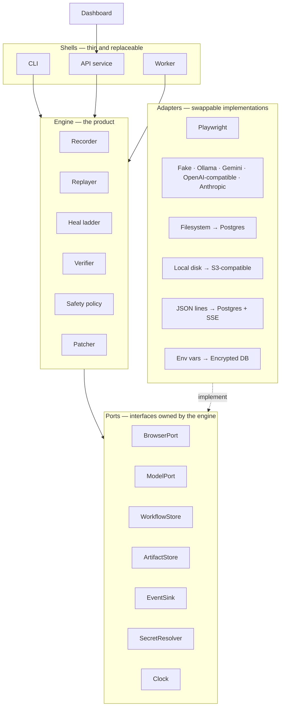

# Mendwork — Architecture

> "Mendwork" is a working name. Rename it before Phase 0 ends if you like; nothing depends on it.

## 1. What this is

**Problem.** Repetitive tasks on websites without APIs are automated today with one of two approaches. Fixed scripts are cheap but break whenever a site's layout changes. AI agents that reason through every step adapt to change but are slow, costly, and inconsistent.

**Solution.** Mendwork records a workflow once and replays it deterministically at near-zero cost. It uses AI only when a step can't find its target, verifies every repair before trusting it, and saves verified repairs permanently. Maintenance cost falls over time instead of growing.

**The whole idea in one picture.** A recorded workflow is a recipe. Replaying it is cooking from the recipe: fast and free. When an ingredient isn't on its usual shelf, the cook first reads the labels on nearby shelves (free). Only if still unsure does the cook ask an assistant (cheap). The cook tastes the dish before serving it (verification), then updates the recipe card so tomorrow it goes straight to the new shelf (patching).

---

## 2. Design principles

These are the rules every design decision is checked against.

1. **The engine is the product.** The engine is a plain Python library. It knows nothing about web servers, databases, or dashboards. The CLI, API, worker, and dashboard are thin shells around it. This lets us test the core without infrastructure and swap shells without touching it.
2. **The happy path never calls AI.** If nothing changed on the site, a run makes zero model calls.
3. **AI chooses; it never invents.** The model only picks from a numbered list of real elements found on the page. It cannot write selectors. If it hallucinates, the answer is out of range and becomes "abstain", which is a safe outcome.
4. **A heal is a proposal until verified.** A repaired step counts as successful only after its checkpoint passes.
5. **Irreversible steps never heal on their own.** Submitting, paying, deleting, or sending requires human approval before a healed target is used.
6. **Workflows are versioned and immutable.** A heal creates a new version and never edits the old one, so any version can be rolled back.
7. **Abstaining is a success.** When the bot isn't sure, stopping and asking is the correct outcome, and it is measured as correct.
8. **Tenant isolation from day one.** Every stored record belongs to a workspace, and the data layer cannot query without one.
9. **Bring your own model.** No model is configured until a person opts in, and the recommended one is a free local model. Providers are swappable adapters, companies plug in their own keys, and hard budget caps prevent surprise bills.
10. **Measured, not claimed.** The benchmark is a first-class component, not an afterthought.

---

## 3. System overview



**Dependency rule:** shells → engine → ports. Adapters implement ports. The engine never imports adapters, Playwright, httpx, FastAPI, or SQLAlchemy. `import-linter` enforces this in CI.

---

## 4. Repository layout

```
mendwork/
├── CLAUDE.md                     # working rules for Claude Code
├── ARCHITECTURE.md               # this file
├── BUILD_PLAN.md                 # phased build prompts
├── pyproject.toml                # uv-managed, single package, src layout
├── uv.lock
├── Makefile                      # install fmt lint typecheck imports test check schema portal bench
├── .importlinter                 # architecture boundary contracts
├── package.json                  # dev-only JS tooling (TypeScript), no runtime deps
├── package-lock.json
├── .nvmrc                        # Node.js major version (24), read by nvm and CI
├── .npmrc                        # engine-strict, save-exact
├── tsconfig.json                 # checkJs + strict, noEmit — type-checks plain JS
├── .vscode/                      # recommended extensions + editor settings
├── .pre-commit-config.yaml
├── .github/workflows/ci.yml
├── docker-compose.yml            # postgres (Phase 10), api, worker
├── docs/
│   ├── adr/                      # one file per architecture decision
│   ├── security.md               # Phase 12
│   └── deploy.md                 # Phase 12
├── schemas/workflow.schema.json  # generated from domain models (`make schema`); a test keeps it fresh
├── workflows/examples/           # hand-written sample workflows for the chaos portal
├── src/mendwork/
│   ├── engine/
│   │   ├── domain/               # pure models: workflow, step, selector, fingerprint, checkpoint, lineage
│   │   ├── ports/                # typing.Protocol interfaces, added by the phase that first uses each
│   │   ├── recording/
│   │   ├── replay/               # replayer, run execution, journal, navigation guard, step runner;
│   │   │                         #   approval records, decisions (ApprovalDesk), resume
│   │   ├── healing/              # candidates, features, scoring, acceptance, alternates, checks,
│   │   │                         #   rung1, rung2, ladder, gates, recovery, run state, explain;
│   │   │                         #   rung3, prompt, choice parsing, eligibility, model rung
│   │   ├── verification/
│   │   ├── safety/               # risk, approvals, egress (rules, addresses, blocks), interruption,
│   │   │                         #   budgets, redaction, secret scrubbing and registration
│   │   ├── patching/
│   │   └── errors.py
│   ├── adapters/
│   │   ├── browser_playwright/   # BrowserPort: launcher, session, Rung 0 primitives, tracing
│   │   │   ├── egress/           # SOCKS5 gateway, DevTools document filter, egress log (ADR 0011)
│   │   │   ├── recording/        # RecordingBrowser: recorder channel, messages, navigation log, sessions
│   │   │   └── js/               # page scripts: page state, element identity and keys, field value,
│   │   │                         #   the recorder and its element facts, candidate extraction
│   │   │                         #   (set-of-marks deferred, ADR 0010)
│   │   ├── models/               # fake, ollama, gemini, openai_compatible (anthropic later);
│   │   │                         #   shared HTTP transport, circuit breaker, pricing, replies
│   │   ├── usage_fs/             # UsageLedger: each UTC day's model-call count, in files
│   │   ├── workflow_yaml/        # strict YAML decoding with line numbers, deterministic encoding
│   │   ├── storage_fs/           # WorkflowStore on files: one directory per workflow, no-overwrite publish
│   │   ├── storage_postgres/     # Phase 10
│   │   ├── artifacts_local/      # ArtifactStore: artifacts/runs/<run_id>/, atomic ordered writes;
│   │   │                         #   RunRecords: per-run flock claims, records read back
│   │   ├── audit_fs/             # AuditLog: artifacts/audit/audit.jsonl, hash-chained, fsynced
│   │   ├── events_jsonl/         # EventSink as JSON lines
│   │   ├── secrets_env/          # SecretResolver: MENDWORK_SECRET_<NAME>
│   │   └── system/               # Clock, Timer, RandomSource, RunIdGenerator, HostResolver
│   ├── apps/
│   │   ├── cli/                  # Typer: validate, schema, record, run, show, approve, reject;
│   │   │                         #   later history, diff, rollback, bench
│   │   ├── api/                  # Phase 10: FastAPI
│   │   ├── portal/               # chaos portal server, shared by `make portal` and browser tests
│   │   └── worker/               # Phase 10
│   ├── settings.py               # pydantic-settings, env prefix MENDWORK_
│   ├── observability.py          # structlog setup: JSON in prod, stderr only, redaction
│   └── py.typed                  # PEP 561 marker: this package ships type information
├── chaos-portal/                 # static demo site + seeded mutation engine (plain JS, @ts-check)
│   ├── js/app/                   # portal behaviour and target declarations (page-targets.js)
│   ├── js/chaos/                 # engine: seeded streams, config, selection, window.__chaos
│   ├── js/mutations/             # one module per mutation
│   └── types/                    # type-only .d.ts files (e.g. window.__chaos)
├── benchmarks/
│   ├── chaos/                    # heal_pairs.json and abstain_pairs.json + their generator
│   │   │                         #   (`make chaos-pairs`), the heal fixture suite, seed surveys,
│   │   │                         #   evaluation models, Rung 3's evaluation and held-out seeds
│   │   └── workflow_targets/     # per example workflow: step id → chaos target key (ground truth)
│   ├── real_apps/                # release A → release B harness
│   └── fixtures/dom/             # before/after DOM snapshots for fast tests
├── dashboard/                    # Phase 11: React + Vite + TypeScript
└── tests/
    ├── fakes/                    # in-memory port implementations
    ├── live/                     # real model provider calls: `make live-providers` only
    ├── unit/
    ├── integration/
    └── e2e/
```

It is a single Python package with enforced internal boundaries. We avoid a multi-package workspace because it adds packaging overhead without adding safety beyond what `import-linter` already provides.

---

## 5. Domain model

All domain models are **Pydantic v2, frozen, closed to unknown fields (`extra="forbid"`), and fully typed**. Variants are discriminated unions, never loose dicts, and validation errors never echo input values. Rationale for everything below: ADR 0006.

### Workflow files

- **One YAML file per version**, decoded by `adapters/workflow_yaml` and validated by the domain models. The engine never imports YAML.
- **`schema_version`** (currently 1) is required. An unsupported version fails with `UnsupportedSchemaVersion` before anything else is checked.
- **Identifiers** (`WorkflowId`, `StepId`, `InputName`, `SecretName`) are lowercase slugs of at most 64 characters, `^[a-z][a-z0-9]*(?:_[a-z0-9]+)*$`. Step ids are unique within a workflow and stable across versions: a heal changes a step's target, never its id.
- **Format bounds** live in `engine/domain/limits.py`, not Settings, because a file valid in one deployment is valid in all:
  - text and list lengths;
  - selector scope depth (2);
  - checkpoint timeouts (1–600000 ms);
  - 1–500 steps.

  The canonical dump omits defaults, so changing a bound or a default is a schema change.
- **`schemas/workflow.schema.json`** is generated from the models with `make schema`.

```python
class ActionType(StrEnum):
    NAVIGATE = "navigate"; CLICK = "click"; FILL = "fill"; SELECT = "select"; PRESS = "press"
    # No DOWNLOAD: a download is a CLICK verified by a download_completed checkpoint.

class RiskLevel(StrEnum):              # classified by consequence, see §8
    SAFE = "safe"                      # reads or navigates only
    CAUTION = "caution"                # changes session or unsaved form state, reversibly
    IRREVERSIBLE = "irreversible"      # changes stored data or affects others

# Ranked ways to find an element. Every variant may be scoped with `within`.
Selector = Annotated[ByTestId | ByRole | ByLabel | ByPlaceholder | ByText | ByCss,
                     Field(discriminator="strategy")]

class ByRole(BaseModel):
    strategy: Literal["role_name"]
    role: AriaRole                     # exactly the roles Playwright's role locator accepts
    name: str
    exact: bool = True                 # False: case-insensitive substring
    within: Selector | None = None     # search only inside the one element this finds; depth ≤ 2

class Fingerprint(BaseModel):
    """Everything we know about a target element, so one changed clue doesn't lose it."""
    tag: str
    role: AriaRole | None
    accessible_name: str | None
    text: str | None
    label_text: str | None
    attributes: FingerprintAttributes  # allowlist: id, name, type, autocomplete, placeholder,
                                       #   aria_label, data_testid, href (path only)
    nearby_text: tuple[str, ...]       # ≤ 8: nearest heading, preceding label, row/column headers
    structural_path: str               # simplified ancestor chain
    bbox: NormalizedBox | None         # relative to the whole document; 0..1, x+width and y+height ≤ 1
    selectors: tuple[Selector, ...]    # 1–10, ranked best-first, no duplicates

# Where a value comes from; secrets are NEVER stored inline
ValueRef = Annotated[LiteralValue | InputValue | SecretValue, Field(discriminator="kind")]
InputDeclaration = Annotated[TextInput | DateInput | UrlInput, Field(discriminator="kind")]

# What "this step worked" means
Checkpoint = Annotated[
    UrlMatches | ElementVisible | TextPresent | DownloadCompleted | ResponseReceived
    | NoErrorBanner | FieldHasValue,
    Field(discriminator="kind"),
]

# One model per action, so each action's shape is enforced by its type
Step = Annotated[NavigateStep | ClickStep | FillStep | SelectStep | PressStep,
                 Field(discriminator="action")]

class FillStep(BaseModel):
    id: StepId
    intent: str                        # "Fill the 'Email address' field"
    action: Literal["fill"]
    risk: RiskLevel
    target: Fingerprint
    value: ValueRef
    checkpoints: tuple[Checkpoint, ...]   # ≤ 10

# Why a version exists. Phase 8 adds a heal variant.
ChangeRecord = Annotated[ManualEdit | Rollback, Field(discriminator="kind")]

class WorkflowVersion(BaseModel):
    schema_version: Literal[1]
    workflow_id: WorkflowId
    version: int                       # ≥ 1
    parent_version: int | None         # None for version 1, otherwise version − 1
    created_at: datetime               # UTC, from the Clock port
    change: ChangeRecord | None        # None for version 1, required otherwise
    inputs: tuple[InputDeclaration, ...]
    secrets: tuple[SecretName, ...]
    steps: tuple[Step, ...]            # 1–500

class HealAttemptReport(BaseModel):    # one per rung per attempt; engine/domain/heals.py (ADR 0009)
    rung: Literal[0, 1, 2, 3]
    attempt: int                           # a failed verification starts another pass
    outcome: RungOutcome                   # resolved, drifted, ambiguous, not_found, no_candidates,
                                           #   below_threshold, below_margin, top_rejected,
                                           #   candidate_cap_reached, page_never_stable; Rung 3:
                                           #   no_eligible, look_alikes, not_asked, model_abstained,
                                           #   choice_out_of_range, output_invalid,
                                           #   model_unavailable, budget_exhausted, choice_refused
    target: TargetEvidence | None          # selector evidence at Rungs 0 and 1
    candidates: tuple[ScoredCandidate, ...]   # best first, with per-feature scores and rejections
    considered: int; on_page: int
    chosen: CandidateId | None; runner_up: CandidateId | None
    score: float | None; margin: float | None
    threshold: float | None; required_margin: float | None
    kind_change: str | None                # e.g. "button → link"
    verification: Verification             # not_performed, pending, passed, failed
    model: ModelChoiceEvidence | None      # Rung 3: the numbered list shown, every call (purpose,
                                           #   outcome, tokens, latency, cost), choice, confidence,
                                           #   reason; engine/domain/model_evidence.py (ADR 0010)

class HealReport(BaseModel):            # on StepResult
    attempts: tuple[HealAttemptReport, ...]
    recoveries: tuple[RecoveryReport, ...]
    healed_rung: Literal[1, 2, 3] | None
    abstention: AbstentionReason | None
    proposal: HealProposal | None          # for an irreversible step awaiting approval
```

### Step shapes

| Action | `target` | `value` | Other |
|---|---|---|---|
| navigate | none | literal absolute http(s) URL, or a url input | |
| click | required | none | |
| fill | required | literal, input, or secret | credential rule (below) |
| select | required | literal or input: the option's visible label | |
| press | optional (else the focused page) | none | `key`: `Modifier+…+Key`, from a closed set of named keys or one printable character |

### Inputs, secrets, and credentials

- **Declarations.** A workflow declares its run inputs and its secret names.
  - Every reference must match a declaration, and every declaration must be used.
  - An input and a secret cannot share a name.
  - Secrets are allowed only in FILL. A navigate input must be of kind url.
- **Input kinds:**
  - `text`;
  - `date`, written `YYYY-MM-DD`;
  - `url`, an absolute http(s) URL with no embedded credentials.
- **Required and optional inputs.** A required input has no default. An optional input (`required: false`) must declare a default that is valid for its kind. Steps are never skipped because an input is missing.
- **The credential rule.** A FILL whose target looks like a credential field must use a secret reference: a literal would be stored in the file, and an input in run history. Detection is a pure function, `detect_secret_field(fingerprint)`, and returns the reason:
  - type `password`;
  - a credential `autocomplete` value;
  - credential words in the field's names and labels.

  Non-credential input types such as email and date always win. When unsure, detection errs towards "secret".

### Checkpoints

- **Kinds and fields:**
  - `url_matches`: `mode` (exact | prefix | regex) and `pattern`;
  - `element_visible`: `selector`;
  - `text_present`: `text`;
  - `download_completed`: `filename_pattern`;
  - `response_received`: `mode`, `pattern`, `status_min`, `status_max`;
  - `no_error_banner`: optional `selector`;
  - `field_has_value` (fill steps only, added in Phase 3 and additive to schema 1): no fields.
- **Patterns** use Python `re` syntax, must match the whole string, and are compiled when the workflow loads.
- **`timeout_ms` is optional**; absent means the runtime default, so the format never hardcodes timing. `no_error_banner` has no timeout: it is checked once, after the step's other checkpoints pass.

### Runs and events

- **`Run`** (saved as `run.json`) records the workflow version, status, bound inputs (secrets by name only), one `StepResult` per step, the run's error, and its model usage totals (calls, tokens, latency, estimated cost, unpriced calls; `run_finished` carries them too). A `StepResult` carries its Rung 0 evidence (every selector's per-level counts and outcome, the winning rank, the identity, or the rung that healed it), navigation report, whether the action reached the page (and, for an interrupted step, whether that is unknown), checkpoint results, error, artifact names, and its `HealReport` when the ladder ran. Steps after the one the run stopped at are `not_run`.
- **Record version 2** (Phase 7, ADR 0011) adds what approvals and interrupts need: the SHA-256 of `workflow.json`, the exact version the run executes, saved beside the record; one `RunSegment` per execution (the first run, then each resume) with the egress policy it was held to; every irreversible dispatch, recorded before it was sent; every `ProposalRecord` (the proposal, the decision and its audit entry, and what came of it); the `ResumeState` a resume needs; the step results a decision replaced; and the last event sequence, so a resume's events continue without a gap. Version 1 records are still read, but cannot be approved or resumed.
- **Stopping statuses.** A step fails, or stops for a person: `awaiting_approval` (a heal for an irreversible step) or `needs_review` (an irreversible action on a heal that failed verification, or a run interrupted after dispatching an irreversible action). The run takes the same status; both exit 4. A run interrupted before any irreversible dispatch is `cancelled` and exits 130.
- **Events** are a discriminated union on `type`, each with `event_version`, `run_id`, a gap-free `sequence` from 1, and a Clock timestamp: `run_started`, `run_resumed` (an approval resumed the run), `step_started`, `target_resolved`, `heal_attempted` (per rung, when it decides), `action_performed` (value kind, never the value), `checkpoint_passed`, `checkpoint_failed`, `heal_verified` (after the checkpoints), `state_restored`, `step_succeeded`, `step_failed` (with the stopping status), `run_finished`.
- **Errors** carry a category: `step`, or `infrastructure` for `InfrastructureError` and anything unexpected.

### Versions

- **Lineage.** Version 1 has no parent and no change record. Each later version is its parent's number + 1 and records a `ChangeRecord`. A rollback restores at most version − 2.
- **Deriving children.** Children come only from pure functions, one per change kind: `edit_version` and `roll_back_version`, plus a heal function in Phase 8. They never mutate the parent, keep every step id in order, and take `created_at` from the `Clock` port.

**Run states:** `QUEUED → RUNNING → SUCCEEDED | FAILED | CANCELLED | AWAITING_APPROVAL | NEEDS_REVIEW`; `AWAITING_APPROVAL → RUNNING` when a proposal is approved (the run resumes), `→ FAILED` when it is rejected, and `→ CANCELLED` when an approval is recorded but the run stops before it resumes.

**Error hierarchy** (`engine/errors.py`):
- `MendworkError`
  - `TargetNotFound`
  - `AmbiguousTarget`
  - `TargetDrifted`: the selectors agree on one element whose identity differs from the fingerprint
  - `TargetNotActionable`: verified, but it cannot receive the action
  - `HealAbstained`: the ladder found nothing it could safely act on, with a `reason`
  - `ApprovalRequired`: a heal was found for an irreversible step
  - `NeedsReview`: an irreversible action on a heal failed verification and is never retried
  - `PageNeverStable`: the page kept changing, so the target could not be verified safely
  - `CheckpointFailed`
  - `NavigationError`
  - `RunTimedOut`
  - `RunCancelled`: an interrupt stopped the run (recorded as the error of a cancelled or interrupted run)
  - `RunBusy`: another process holds the run
  - `UnknownRun`: no readable record exists for the run id
  - `ProposalNotPending`: the proposal is unknown, already decided, or its run no longer awaits approval
  - `RunNotResumable`: an approval could not resume the run, so nothing was recorded
  - `ApprovalStale`: the resumed page no longer shows the approved element; nothing acted
  - `SecretUnavailable`
  - `ProviderError`
    - `ModelOutputInvalid`: the model replied, but not as exactly one choice
  - `PolicyViolation`
    - `EgressBlocked`: the egress policy refused a navigation, a document, or a connection
  - `BudgetExceeded`
  - `VersionConflict`: a version number is taken, or its parent is missing
  - `WorkflowValidationError`, which carries every `ValidationIssue` (path, message, line, column, step id)
    - `UnsupportedSchemaVersion`
  - `RunInputError`, which carries every issue with the supplied inputs
  - `RecordingUnusable`: a recording cannot produce a replayable workflow, so nothing is written
  - `InfrastructureError`
    - `BrowserUnavailable`
    - `ArtifactStoreUnavailable`
    - `AuditLogCorrupt`: the audit log cannot be read or written, or its chain is broken

**Ports so far:** `Clock`, `WorkflowStore`, and from Phase 3 `BrowserLauncher`/`BrowserPort`, `ArtifactStore`, `EventSink`, `SecretResolver`, and the small ports that keep the engine deterministic: `Timer` (monotonic time and backoff pauses), `RandomSource` (jitter), and `RunIdGenerator`. From Phase 4, recording adds `RecordingLauncher`/`RecordingBrowser` (a BrowserPort plus page events, element facts, and the hold-back handshake), `RecordingObserver`, and `StopSignal`. From Phase 6, `ModelPort` (a numbered choice in, a choice or null out) and `UsageLedger` (each UTC day's model-call count). From Phase 7, `HostResolver` (a host name's addresses, for the egress policy), `RunRecords` (claiming a run for one process, and reading its record and workflow snapshot back), and `AuditLog` (append-only, chained decisions); `BrowserLauncher.session` takes the run's `EgressPolicy`, and `BrowserPort.take_egress_blocks` reports what the browser-side layers refused. A store instance is bound to one tenant when it is constructed, so its methods take no workspace. From Phase 5, `BrowserPort` also reads `element_facts` (moved up from the recording port) and `scan_candidates` for healing. Port data are plain models; no Playwright type crosses a port.

---

## 6. Recording and run lifecycle

### Recording

`mendwork record <start-url> --out <file>` turns one performance of a task into version 1 of a workflow that is proven to replay. Details: ADR 0008.

- **Hold back, verify, perform.** An init script in every document holds back plain clicks and Enter, Escape, and Space. For each one, the recorder:
  1. verifies the target;
  2. arms the page and performs the action with the replayer's own primitives;
  3. disarms the page and settles;
  4. records the step.

  Typing stays native: a field is reported once, when its edit is committed.
- **Ignorable versus fatal.**
  - **Ignorable, with a notice, and recording continues:** modified clicks and keys, double-clicks, file inputs, frames, clicks on controls that were not ready, and anything started while a step is being recorded.
  - **Fatal, and nothing is written:** no surviving selector, an unconfirmed identity, a page that never settles, a new tab, a browser navigation during a step, a back-forward-cache restore, or an element that vanished before its step was recorded.
- **Navigations.**
  - A commit inside a step's window belongs to that step.
  - Outside any window, a browser-started navigation (address bar, back, forward, reload) is a NAVIGATE step.
  - A page-started navigation outside any window is not a step.
- **Selectors.** Candidates are ranked test_id > role_name (full name, then the element's own text) > label > placeholder > text > css.
  - Each candidate is kept only if it resolves, in a consistent snapshot, to exactly the recorded element.
  - An ambiguous candidate is scoped by its ancestors: rows by row header first, at most two levels deep.
  - The fingerprint must then resolve through Rung 0 to the same element.
- **Checkpoints.** Proposed from before and after observations (§8) and verified at record time; one that fails is dropped with a warning.
- **Secrets.**
  - No page message can carry a value.
  - A credential field (`detect_secret_field`, or masked on the page) becomes a secret reference without its content ever being read.
  - Every payload from the page passes an observer a test inspects.
- **Naming and writing.**
  - Secrets are named after recording stops; the start URL and email- or username-like values are proposed as inputs, each with a name and a description derived from the start URL's path or the field's label. The person can answer `name` or `name: description`.
  - The workflow is validated, written without overwriting, and replayed in a fresh browser.
  - Only a successful replay reports the recording as verified; `--no-verify` skips it with a warning.

### Running

1. **Preflight**, which creates nothing: load the `WorkflowVersion`, bind run inputs (required, defaults, unknown names), and check that every declared secret can be resolved. Secret values are resolved only in memory, at the moment of use.
2. Check every navigate URL known up front (literals and bound inputs) against the egress policy (§8, ADR 0011).
3. Create the run id, claim the run for this process, save `workflow.json` and its digest, write `run.json` as `running`, emit `run_started`, and open one isolated browser session held to the egress policy.
4. For each step:
   1. Emit `step_started`.
   2. Resolve the target through the heal ladder, starting at Rung 0 (§7): settle, evaluate every selector, check stability, consensus, identity.
   3. If the target was healed and the step is `IRREVERSIBLE`, pause the run as `AWAITING_APPROVAL` with a pending proposal: the element, every number the decision used, its position (shown, never matched), and a screenshot.
   4. Run pre-action checks on the pinned element: attached, same identity, visible, enabled or editable, compatible with the action.
   5. Watch for the events the step's `download_completed` and `response_received` checkpoints observe.
   6. Perform the action on the pinned element, then let the page settle again.
   7. Evaluate every checkpoint (§8); a new tab or window fails the step.
   8. **Pass:** record the `StepResult` and a screenshot, plus a `ChangeRecord` if the step was healed (Phase 8). **Fail:** a SAFE or CAUTION heal that failed verification is recovered (§8) within its attempt limit; otherwise record screenshot, DOM snapshot, and trace (unless it could hold a secret) and stop the run.
5. Finish: set the final status, total model usage and estimated cost, write `run.json`, emit `run_finished`, and apply the patch promotion policy (§9).

**The journal.** `run.json` is rewritten atomically when the run starts, after every step, just before an irreversible action is dispatched, and when the run finishes, so a record left by a process that stopped still says which steps finished and whether an irreversible action may have been sent (ADR 0011).

**Interrupts.** A first Ctrl+C (or SIGTERM) stops the step in progress where it is, records it without touching the browser again, and ends the run `cancelled`, or `needs_review` if an irreversible action was dispatched; neither is ever re-run automatically. A second aborts at once, finishing the record from the journal on disk. `mendwork show` completes a record whose process ended without either.

**Approval and resume.** `mendwork show` lists a run's proposals with their evidence; `mendwork approve` and `mendwork reject` decide one. The decision is appended to the audit log before the record is written, and neither write is cut short by an interrupt. A rejection ends the run `failed`. An approval resumes it at once in a new browser: the steps before the approved one are replayed quietly to rebuild its page, then the step runs from Rung 0. If the recorded element is found, the heal was not needed; otherwise the ladder runs without a model and may act only on the approved element, matched on what it is and not where it sits. Anything else fails the step with `ApprovalStale` and nothing acts. A run cannot resume past an earlier irreversible step, from a changed `workflow.json`, or with an input that held a secret's value.

Transient retries are **separate from healing**. Only a navigate step's page load is retried, for timeouts, dropped connections, and 502/503/504, with bounded exponential backoff and jitter. Actions and resolution are never retried. Every wait is bounded by the step, checkpoint, navigation, and run timeouts from Settings. Details: ADR 0007.

---

## 7. The heal ladder

Each rung is more expensive than the one before it. We only climb when the rung below fails.

| Rung | What it does | Cost |
|---|---|---|
| **0** | Try the recorded selectors in ranked order. A selector must match **exactly one** visible element (every `within` level included): zero matches is not-found, and more than one is ambiguous, never a success. The one element must then pass the identity check below. | Free |
| **1** | Try alternate selectors derived from the fingerprint that were not recorded (test id, role + name, role + visible text, label, placeholder, text, stable id or name, each also within the recorded scopes). Accepts only the recorded identity. | Free |
| **2** | Similarity scoring over live candidates (below). | Free |
| **3** | The model chooses among the top-K candidates from Rung 2. | Cents or $0 local |
| **4** | Abstain: pause for a human or fail with a full evidence report. | Free |

### Rung 0 — consensus and stability

- **Every** recorded selector is evaluated. Only visible elements count, at every scope level.
- Hits on one element: that element, by the best-ranked hit. Hits on different elements: `AmbiguousTarget`. No hit but a selector matched several: `AmbiguousTarget`. Otherwise `TargetNotFound`.
- The page settles first (load event, then animation frames without a DOM mutation). A snapshot the DOM changed under is discarded and read again; a page that changes during every attempt fails with `PageNeverStable`.
- Not-found waits for the next DOM change until the step deadline. Ambiguous and drifted verdicts stop at once on a quiet page.
- The verified element is pinned and every action goes through the pinned node, never through a selector that could match something else later.

### Rung 0 — identity check (drifted matches)

A selector that resolves to exactly one element is a candidate, not yet a success.

- **How identity is read:** a page script computes tag, type, role, and accessible name the way Playwright does, without reading field values. Playwright then confirms it: a role and exact-name selector, through the same mapping Rung 0 uses, must find the element. An unconfirmed identity counts as different.
- **Same element:** the element's role and accessible name match the fingerprint (names compared after NFKC, case folding, and whitespace collapsing). A fingerprint without a role (password and date inputs) is compared on tag, type, and name instead. The step proceeds.
- **Drifted match:** either one differs. A drifted match must pass the same acceptance rules as a heal before any action:
  - danger keywords;
  - the risk policy (IRREVERSIBLE needs approval);
  - verification by the step's checkpoints.
- **Examples:** harmless drift such as "Download CSV" → "Export data" can pass; "Download CSV" → "Delete data" must abstain.
- **Why this exists:** ids and test ids routinely survive a relabel. The chaos portal's `dangerous_rename` keeps both, so `test_id` and `css` selectors still find the renamed control exactly once.
- **Phasing:** since Phase 5, a drifted match is not discarded: it joins Rung 2 as a candidate like any other and must earn acceptance on its merits.

### When healing runs (ADR 0009)

- Rung 0's `TargetNotFound`, `AmbiguousTarget`, and `TargetDrifted(identity_changed)` go to the ladder. `PageNeverStable`, a target that changed or detached before the action, and a run out of time do not.
- Healing has its own budget (`MENDWORK_HEAL_TIMEOUT_MS`), capped by the run deadline.

### Rung 1 — alternate selectors

- Evaluated with Rung 0's consensus inside one consistent reading.
- **Accepts only the recorded identity:** the alternates agree on one element whose identity matches the fingerprint exactly (confirmed by Playwright), it reaches the accept threshold, no safety rule refuses it, and it has not failed verification. No margin: uniqueness by identity rules out a look-alike.
- Anything else it found joins Rung 2 as a candidate.
- On a fresh recording Rung 1 has nothing new to try, because the recorder keeps every selector that resolved uniquely; it exists for hand-written or imported workflows and for recordings whose selectors have gone stale (ADR 0009, finding 5).

### Rung 2 — similarity scoring

- **Candidates.** The adapter's `scan_candidates` pins the visible elements the action could receive (`js/extract_candidates.js` finds them; the existing identity and facts scripts describe them, never reading a field's value). The engine keeps those the action can act on, adds the drifted Rung 0 match and any Rung 1 hit, and drops duplicates and candidates that already failed verification.
- **The cap is a capability limit.** A page with more candidates than `MENDWORK_HEAL_CANDIDATES_MAX` (4,000) is never healed: scoring part of a page cannot prove the margin. The default is 2.3 times the heaviest page measured (a Wikipedia table with 1,769) and scans twice within the heal budget.
- **Features**, each from 0 to 1, weights in Settings:

  | Group | Feature | Weight |
  |---|---|---|
  | Wording | accessible name similarity (rapidfuzz token-sort, above a noise floor) | 0.25 |
  | | label similarity (the name, for controls without a label) | 0.05 |
  | Identity attributes | recorded id, name, test id, autocomplete, href, aria-label, placeholder that survived | 0.25 |
  | Kind | role match (0.5 within button/link/menuitem) | 0.10 |
  | | tag and effective type | 0.05 |
  | Context | nearby-text similarity (the path, when none was recorded) | 0.10 |
  | | structural path similarity | 0.10 |
  | Position | box-centre proximity | 0.10 |

  A clue the recording did not have scores 0; groups are never renormalized.
- **Score:** the weighted sum, rounded to nine decimals, ranked by score then signature, never by page order.
- **Accept rule:** the top candidate must pass every safety rule, `top_score ≥ T_ACCEPT` (0.60), `top_score − best unrefused other ≥ M_MARGIN` (0.15), and Playwright must confirm its identity. Otherwise abstain, with both numbers in the evidence.
- **Why those numbers.** Losing any one group of clues still scores at least 0.70; with no wording and no identity attributes in common a candidate tops out at 0.45; no single layout clue weighs more than 0.10. Settings refuses any configuration where context can reach the threshold or one weak clue can open the margin.
- Weights are derived, not tuned. **Optional ML upgrade:** learn the weights, or a small ranking model, from benchmark data, then compare it against the derived weights and the LLM on accuracy, latency, and cost.

### Safety rules that override score

- **Danger words:** a candidate whose name, text, or label adds a danger word the recording did not have is refused, read through the risk classifier's own function and vocabulary.
- **Identifiers:** a candidate naming a different number than the recording ("INV-7780" for "INV-2231") is refused.
- **Kind:** submit, activate, toggle, text entry, date, and choice controls never stand in for one another. A button ↔ link change within activate or submit is allowed only when the step has an effect checkpoint, which then proves the activation was equivalent.
- **Credentials:** a credential is typed only into a masked field a selector can mask in screenshots, and a plain value never into a masked one.
- **Gates after acceptance:** a heal needs a checkpoint that can prove it; an irreversible step stops for approval with a proposal; a step acts on at most `MENDWORK_HEAL_MAX_ATTEMPTS` healed targets, and an authentication step on one.

### Rung 3 — constrained model choice (ADR 0010)

The model is a chooser, never an author: it picks one number from a list of elements the ladder already pinned and scored, or null. It never writes a selector, never receives markup or a screenshot, and gives no safety guarantee. Everything that prevents a harmful action runs on its pick.

- **When.** Only when a model is configured and Rung 2 declined with `below_threshold` or `below_margin`. Never after Rung 2 accepted; never on `top_rejected` (a person should look), a capped or unstable page, or no candidates.
- **What it is shown.** Eligible candidates only: no safety rule refused them, and they share wording (name or label) or identity attributes with the recording, so context alone never establishes identity for a model either. The best `MENDWORK_MODEL_CANDIDATES_K`, numbered, each as kind, name, label, visible text when it says more, nearby text, and Rung 2's score. The prompt (`engine/healing/prompt.py`, `choose-candidate/1`) is a pure function; page text is scrubbed of secrets (base64 forms included), normalized, shortened, and quoted as JSON, so it can neither leak a secret nor forge a line. The step is described by its action and intent, never its value.
- **When nothing is asked.** No eligible candidate, or the best one reads exactly like another (a choice between them would be position alone): Rung 2's abstention stands. A gate that does not depend on the pick (no checkpoint that can prove a heal, no heal attempts left) abstains before any call.
- **Reading the answer.** One JSON object with exactly `choice` (integer or null), `confidence` (0 to 1), and `reason` (1–300 characters), parsed strictly by `engine/healing/choice.py` for every provider: no fence stripping, no coercion, duplicate keys and NaN refused. A reply in any other shape, cut off, or withheld gets one repair call, then abstains. Null abstains. A number outside the list abstains without a repair.
- **Judging the pick.** It is read again from the page and must pass every safety rule on what it is now (danger words, identifiers, kind, button ↔ link, credentials), still read exactly as the model was shown it, have no look-alike among the eligible candidates (shown or not), be confirmed by Playwright, and sit on a page whose DOM has not changed since Rung 2 read it. Then the ordinary gates apply (a checkpoint that can prove it, approval for an irreversible step, attempt limits), and the step's checkpoints decide.
- **Rules only a model's pick faces** (`engine/healing/pick_rules.py`), because a pick has no score margin behind it. Both only refuse; Rung 2 is unchanged.
  - *Context veto:* when the recording has nearby text, a pick sharing none of it is refused (`context_lost`).
  - *Weak verification:* on a step whose checkpoints only check where it leads (`url_matches`) or what a field holds (`field_has_value`), with no `element_visible`, `text_present`, `download_completed`, or `response_received`, a pick must keep the recorded `id`, `name`, or test id (`weak_verification`). A navigation link and a card link to the same page both pass `url_matches`, so that checkpoint cannot prove which one was clicked. The bar was chosen from a census of every line a model was shown (ADR 0010).
- **Confidence** is recorded and shown, and no decision reads it.
- **Budgets** (`engine/safety/budgets.py`): at most `MENDWORK_MODEL_MAX_CALLS_PER_RUN` calls per run and `MENDWORK_MODEL_MAX_CALLS_PER_DAY` per workspace per UTC day. Every call, a repair included, is reserved before it is made; the day's count lives behind the `UsageLedger` port (files now, a table from Phase 10), and an unreadable ledger allows no call. A used-up budget raises `BudgetExceeded` and the step abstains.
- **Restores** replay an earlier Rung 3 heal by its signature, without asking the model again.

Every rung emits a `heal_attempted` event with its full evidence, and `heal_verified` follows the checkpoints, so every decision can be explained later.

---

## 8. Verification, recovery, and safety

### Checkpoints

Recording auto-proposes checkpoints from what a step changed, and keeps only those that pass when the step is recorded:

- a changed URL path gives `url_matches` with a host-agnostic regex;
- a heading or named landmark that became visible gives `element_visible`;
- a live region whose text changed without a navigation gives `text_present`;
- a completed download gives `download_completed`;
- a form submission gives `no_error_banner`;
- a fill gives `field_has_value`.

Response checkpoints are not proposed. Users can edit any of them. Every waiting checkpoint has a timeout (its own `timeout_ms` or the runtime default) and waits for page changes or events, never for time. **There are no fixed sleeps anywhere.**

- **Order:** as written, with `no_error_banner` last and checked once.
- **Watched before the action:** `download_completed` and `response_received`, whose listeners exist before the action is dispatched.
- **`no_error_banner`:** no visible `role=alert` element with non-whitespace text; with a selector, that selector matches no visible element.
- **`field_has_value`:** the fill step's field holds the step's resolved value, compared inside the page; for a secret, only that the field is not empty. The value never leaves the page.
- **`element_visible`:** exactly one visible element at every scope level.
- **`text_present`:** the page's rendered text contains the text, whitespace-normalized and case-sensitive.

### Recovery policy

| Risk | On failed checkpoint after a heal |
|---|---|
| SAFE | Restore the last known-good state, exclude the failed candidate, and run the ladder again, up to `MENDWORK_HEAL_MAX_ATTEMPTS`. |
| CAUTION | Same as SAFE, and clear the field a failed fill typed into first. |
| IRREVERSIBLE | Never auto-retry. Heals require approval **before** acting. An irreversible action that ran on a heal and failed verification ends the run in `NEEDS_REVIEW`; a run interrupted after an irreversible action executed also becomes `NEEDS_REVIEW` (Phase 7) and is never re-queued automatically. |

**Restoring the last known-good state** (ADR 0009):

1. Every step records the document and URL it began on; the steps that began on the failed step's document are its segment.
2. The segment's first URL is re-opened (unsaved state is discarded) and must be landed on exactly.
3. The segment's earlier steps are replayed quietly, each resolved by Rung 0 or by its own verified heal, with every checkpoint passing again.
4. Restoring is refused when it would replay an irreversible step, and fails when the page lands elsewhere or a replay fails. The step then abstains; nothing is retried blindly.

A step with no checkpoint that can prove a heal abstains rather than healing silently. A verified heal is reused only for replays of the same step within a restore.

**Authentication steps** (steps that fill a credential, or that the risk classifier reads as changing the session, including submitting a form that holds a password) get at most **one** heal attempt per run, whatever their risk level. Repeated attempts can lock the account.

### Risk classification

Risk is classified **by consequence**, not by mechanism:

| Level | What the action changes | Examples |
|---|---|---|
| `SAFE` | Nothing: it reads or navigates only | links, filters, downloads, opening details |
| `CAUTION` | Session or unsaved form state, reversibly | fills, sign in, sign out |
| `IRREVERSIBLE` | Stored data, or something other people see | submitting orders, paying, deleting, sending, saving settings |

- **Signals, not rules.** Submitting a form and a name matching configurable danger keywords (delete, remove, pay, purchase, submit, send, confirm, transfer, save, …) are signals. A filter form is submitted and is still `SAFE`; a plain button named "Delete" is `IRREVERSIBLE`.
- **The order is the policy** (`engine/safety/risk.py`, a pure function):
  1. A danger word is `IRREVERSIBLE` on any element, unless every danger word is a soft verb acting on view state ("Remove filter").
  2. Signing in or out, or submitting a form that holds a password, is `CAUTION`.
  3. Read words, a download, a plain link, or a tab are `SAFE`.
  4. A form control is `CAUTION`.
- **Unknown is `CAUTION`.** A plain button or a submit with no recognised word ("Continue", "Next", "OK") changes something reversible as far as anyone can tell. Calling it irreversible would make approvals so frequent that people stop reading them. Stricter is chosen within this order, never by defaulting to `IRREVERSIBLE`.
- **The vocabulary lives in Settings** (`MENDWORK_RISK_*`). Soft verbs must be danger words, and view-state nouns must be read words.
- **One source of danger.** The healer reads danger words and session phrases through the classifier's own functions (`danger_words_in`, `authentication_reason`) and the same vocabulary, and a test proves the two cannot disagree.
- **Overrides.** Users can raise a step's risk level, but cannot lower an auto-detected `IRREVERSIBLE` without an audit entry.

### Egress policy (SSRF protection)

- **Deny by default.** A per-workspace allowlist of host names for top-level navigation: exact names, or `*.example.com` for any subdomain. An empty allowlist allows no navigation.
- **Schemes and URLs.** Only `http` and `https` load, in every frame; a URL a browser could read differently from Mendwork (credentials in it, a malformed host, an out-of-range port) is refused.
- **Addresses.** Loopback, private (RFC 1918 and IPv6 ULA), shared (100.64.0.0/10), link-local, multicast, unspecified, every other non-global range, and named cloud-metadata endpoints (including the publicly routable Azure WireServer) are refused, in IPv4 and IPv6, with IPv4 carried inside IPv6 (mapped, compatible, 6to4, Teredo, NAT64) checked as itself and numeric host forms read as a browser reads them.
- **Three layers, because Playwright routing cannot see redirect hops** (measured; ADR 0011):
  - the engine checks every navigate URL before the browser is asked, and every URL known up front before the run starts;
  - a DevTools `Fetch` filter pauses every document request in the run's page, each redirect hop included, and fails any the scheme, URL, address, or (for the page itself, not frames) allowlist rules refuse;
  - a per-session SOCKS5 gateway carries every connection of the run's browser context (subresources, WebSockets, frames, popups): it resolves a name once, refuses any internal or metadata address, and connects only to the addresses it checked, so DNS rebinding between the check and the connection is impossible. Service workers are blocked, and WebRTC may not send UDP outside the proxy.
- **Local test targets.** Exact loopback `ip:port` origins may be exempted for the chaos portal and fixture sites; Settings refuses any in production.
- Every refusal fails the step with `EgressBlocked`, names its rule, host, and layer, and is never retried or healed. The recorder is not held to the policy: a person drives that browser.

### Secrets

- Workflows store only secret *references*.
- A `SecretResolver` port supplies values at the moment of use. The environment adapter reads `MENDWORK_SECRET_<UPPER_SNAKE_NAME>`, a namespace Settings reserves (ADR 0003); `.env` never supplies secrets.
- Each run scrubs resolved values, in raw and escaped forms, from all outside text entering its records: errors, identities, checkpoint details, URLs, and DOM snapshots.
- **Traces** pause before a secret is typed, resume only on a different document, are withheld when a failure happens on the secret's document, and are scanned for every secret encoding before being kept. **Screenshots** mask password fields and fields filled from secrets.
- Tested end to end: a distinctive secret is searched for in stdout, stderr, events, `run.json`, DOM snapshots, and every trace member (ADR 0007), and, through a pause, `show`, `approve`, and a `reject` whose reason contains the secret, in the audit log, `workflow.json`, the resumed segment's trace, and every command's output (ADR 0011).
- **Model prompts** are built only from scrubbed text, with a secret's base64 forms removed as well; a test runs a heal through every provider adapter and searches each request body for every encoding (ADR 0010).
- **Logs.** Values under sensitive field names are redacted before rendering. Every command also wraps its `SecretResolver` so each value is registered, at the moment it is resolved, with the process's scrubber, and the log pipeline scrubs every rendered line, tracebacks included, of those values in every covered encoding (ADR 0011).
- **Decisions.** A rejection's reason is scrubbed of the run's secrets before it reaches the audit log or the record.

### Explicit non-goals

- CAPTCHA solving, bot-detection evasion, or anything else that circumvents a site's protections.
- The tool automates only sites a workspace is authorized to automate.

---

## 9. Patching and versions

- A verified heal on a SAFE or CAUTION step produces a `ChangeRecord` containing:
  - old vs new fingerprint
  - which rung healed it
  - score and margin, or model usage
  - artifact links
- The `ChangeRecord` produces a **child** `WorkflowVersion`. IRREVERSIBLE heals do this only after approval.
- **Promotion policy** (Settings):
  - `immediate` persists the new version right away.
  - `after_n_successes` applies the patch as a first-try candidate on later runs and persists it only after N verified successes.
- Users can view history, diff any two versions in human-readable form, and roll back to any version.
- **The key guarantee:** after a heal is promoted, rerunning the same page state uses **zero heals and zero model calls**.

---

## 10. Model providers

```python
class ModelPort(Protocol):
    async def choose_candidate(self, request: ChoiceRequest) -> ChoiceResult: ...
```

- **Adapters** (`adapters/models`):
  - `FakeModel`: scripted replies or a function of the request, parsed like any provider's; tests and benchmarks
  - `Ollama` (local, free): `/api/chat` with the reply schema as `format`, fixed temperature and seed
  - `Gemini` (free tier, dev/demo only): `generateContent` with `responseJsonSchema`
  - `OpenAI-compatible` (any host exposing Chat Completions, including local servers): strict `json_schema`
  - `Anthropic`: later
- **Shared behaviour** (`HttpChoiceModel`): a wire format per provider; everything else is common:
  - one time limit per call covering every attempt, capped by the heal deadline
  - retries with exponential backoff and jitter on timeouts, dropped connections, 408, 429, and 5xx; a short `Retry-After` is honoured, a long one ends the call; other 4xx are not retried
  - a circuit breaker per provider: consecutive failures pause calls, then one trial call decides
  - bounded reply size; a malformed reply is a provider error, a reply in the wrong shape is invalid output
  - usage, latency, HTTP attempts, and estimated cost per call (price table in `MENDWORK_MODEL_PRICES`; local = $0; a hosted model without a price is unpriced, never free)
- **No model by default.** `MENDWORK_MODEL_PROVIDER=none` until a person opts in; with a model configured, a run that needs no Rung 3 still makes zero calls, and creating the client opens no connection.
- **Tests** replay recorded HTTP fixtures (respx). No test reaches the network: the test suite refuses non-loopback connections. `make live-providers` calls the configured provider for real, locally only.
- **Data policy:** free hosted tiers may use inputs to improve the provider's models. Use them **only with chaos-portal and benchmark data**. Company workspaces must use a local model or their own paid key.
- Model names are configuration, never hardcoded. Small models change monthly.

---

## 11. Multi-tenancy and security (built in Phase 10, designed now)

- **Workspace:** the tenant boundary. Every tenant table has `workspace_id NOT NULL`, and repository methods require a `WorkspaceContext`. Postgres row-level security is optional defense in depth.
- **Members and roles:** owner, admin, operator (run and approve), viewer.
- **API keys:**
  - random 32+ bytes, shown once
  - stored as prefix + SHA-256 hash
  - scoped, revocable, with `last_used_at` tracked
- **Secrets and saved browser sessions:** encrypted with `MultiFernet`, master keys from environment, key rotation supported.
- **Audit events** (append-only) record key creation, approvals, policy changes, rollbacks, and risk downgrades. From Phase 7, approvals and rejections are recorded through the `AuditLog` port in `<artifacts>/audit/audit.jsonl`: one JSON line per decision, each numbered and chained to the one before by SHA-256, written under an exclusive lock and fsynced before the run's record changes; a broken chain refuses every further decision (ADR 0011). Who decided is recorded from Phase 10, with members. In Phase 10 the log becomes a table whose role may only insert.
- **Browser isolation:**
  - a fresh browser context per run, with no shared cookies across workspaces
  - a per-run downloads directory
  - non-root worker containers with resource limits and max concurrency
- **Logging:** structured, secrets redacted, `run_id`/`step_id`/`workspace_id` correlation on every line.
- **v1 access model:** invite-only. The platform admin creates workspaces and issues keys. No self-serve signup, billing, or SSO in v1.

---

## 12. Service layer (Phase 10)

- **API:** FastAPI under `/v1`.
  - workflows, versions, runs (`POST` with `Idempotency-Key`), run events (Server-Sent Events), heal proposals (approve/reject), secrets (write-only), API keys (admin)
  - RFC 9457 problem-details errors, cursor pagination, per-key rate limits, OpenAPI docs
- **Queue:** the `runs` table *is* the queue.
  - Workers claim jobs with `SELECT … FOR UPDATE SKIP LOCKED`.
  - Heartbeats plus lease expiry re-queue crashed runs, respecting the `NEEDS_REVIEW` rule.
  - No Redis needed.
- **Events:** the engine emits to an `EventSink`. Events are persisted to `run_events` and streamed to the dashboard over SSE.
- **Artifacts:** a screenshot per step; Playwright trace and DOM snapshot on failure or heal. Stored behind the `ArtifactStore` port (local disk, then S3-compatible), with configurable retention.

---

## 13. Benchmarking

### Chaos portal

- A static fictional supplier portal with a seeded mutation engine (`?seed=&level=&only=`). The same URL, seed, and level always produce a byte-identical DOM: nothing reads the clock, timezone, locale, or unseeded randomness. Each page derives its random streams from `(seed, pageId)`.
- **Configuration persists:** parameters on any page replace the stored configuration; pages without parameters reuse it, so plain links keep chaos on.
- **Levels:** level L applies L mutations per page. Levels 1–3 are heal-only. At levels 4 and 5, exactly one page per seed — chosen from the seed alone, so every page agrees — replaces one heal mutation with an abstain mutation.
- **Conflicts:** mutations claim aspects of a target (element, attributes, label, ancestry, position); overlapping claims are refused and abstain mutations claim everything.
- **Ground truth is exposed only through JavaScript**, as `window.__chaos` (`seed`, `level`, `pageId`, `ready`, `error`, `abstainPageId`, `applied`, `wrongActions`, `locate(targetKey)`). The DOM carries no marker identifying a target. Mendwork's recorder and healer must never read `window.__chaos`.
- **Wrong actions are harmless and recorded:** decoys and dangerous controls change nothing, append to `wrongActions`, and show a notice. On an abstain-expected step, any activation counts as wrong.
- Details: `chaos-portal/README.md`, ADR 0004.
- **Heal-expected mutations:**
  - synonym renames
  - sibling reorder
  - id/class changes
  - extra wrappers
  - moving a control to another container
  - button↔link swap
  - icon-only button with aria-label
  - cookie banner
- **Abstain-expected mutations:**
  - target removed
  - two equally plausible controls
  - control renamed to a dangerous opposite (e.g. "Download" → "Delete data")

### Heal fixture suite

- Every heal_expected pair (`heal_pairs.json`) and abstain_expected pair (`abstain_pairs.json`) on a target the example workflows act on, plus `cookie_banner` on each page they visit: 67 cases.
- Each case replays the committed steps on the mutated page. Before every action, a test-side wrapper asks `window.__chaos.locate` whether the pinned element is the step's real target; a miss, a recorded wrong action, or any action at an abstain step fails the case.
- Cases run in separate browser contexts, a few at a time; the suite prints a per-mutation table (resolved, abstained, wrong, rungs). The same cases run outside pytest with `python -m benchmarks.chaos.heal_suite`.

### Real-app pairs

A workflow recorded on release A of a self-hosted open-source web app is replayed on release B, running locally in Docker. These are real UI changes nobody faked, on our own instances, so there is no terms-of-service issue.

### Metrics

- **Wrong-action rate** (headline metric; target 0)
- heal success rate
- correct-abstain rate
- unnecessary-abstain rate
- model calls per run
- estimated cost per run
- p50/p95 step latency
- rung distribution

### Baselines

- recorded CSS selector only
- Playwright role + name locator only
- full ladder without Rung 3
- full ladder

### Output

Versioned results JSON and a static HTML scorecard. CI runs a small smoke benchmark and **fails if the wrong-action rate is above 0**.

---

## 14. Testing strategy

| Layer | Covers | Rules |
|---|---|---|
| Unit | domain, scoring, policies, prompt building, parsing | No network, no browser; fakes from `tests/fakes`; `hypothesis` for invariants |
| Heal fixtures | heal ladder decisions | Live chaos portal pairs with ground truth checked at every action; `page.set_content` pages for the candidate scan; a wrong action fails the test |
| Integration | replayer, recorder, verifier | Against the locally served chaos portal only |
| Provider contract | model adapters | Recorded HTTP fixtures (`respx`); live calls only via `make live-providers` |
| API | endpoints, tenant isolation, queue | Real Postgres (CI service container); isolation tests for every resource |
| E2E | full run, heal, patch, rerun with zero model calls | CLI first, then API |

**Coverage gates:** engine ≥ 90% lines, overall ≥ 85%.

**No flaky tests:** fixed seeds, injected `Clock`, no sleeps.

---

## 15. Tech stack

Everything below is free and open source.

| Concern | Choice |
|---|---|
| Language | Python 3.12+ |
| Environment and packaging | uv |
| Browser automation | Playwright (async API) |
| Models, validation, config | Pydantic v2, pydantic-settings |
| Fuzzy text matching | rapidfuzz |
| CLI | Typer |
| API | FastAPI + Uvicorn |
| Database | PostgreSQL 16, SQLAlchemy 2.0 (async), asyncpg, Alembic |
| Job queue | Postgres `SKIP LOCKED` |
| HTTP client | httpx (respx in tests) |
| Logging | structlog |
| Encryption | cryptography (Fernet / MultiFernet) |
| Quality gates | ruff, mypy --strict, import-linter, pytest, pytest-asyncio, pytest-cov, hypothesis, pre-commit, pip-audit |
| Dashboard | React + Vite + TypeScript |
| Browser-side JavaScript | Plain JS with JSDoc types, checked by TypeScript (`checkJs`, `noEmit`); no build step |
| JS tooling | Node.js LTS + TypeScript compiler (dev-only) |
| Reverse proxy | Caddy (automatic HTTPS) |
| CI | GitHub Actions |

### Languages, and when to add one

| Language | Used for | Why |
|---|---|---|
| Python | Engine, CLI, API, worker, benchmark | Best AI and Playwright ecosystem; the core of the product |
| TypeScript | Dashboard | Type safety for a large UI |
| JavaScript + `@ts-check` | Chaos portal, injected page scripts | Code running inside a web page must be JavaScript; TypeScript checks it without a build step |
| SQL | Postgres schema, migrations, queue claims | Data and job queue live in Postgres |
| HTML/CSS | Chaos portal, run reports, scorecard | What browsers render |

A new language is added only when:
1. code must run somewhere the existing languages cannot, or
2. a **measured** problem is fixed by it.

Either way, it requires an ADR. More languages mean more toolchains, more CI steps, and more places to break. Browser automation spends most of its time waiting on pages, so rewriting the core in a faster language would not make runs meaningfully faster.

---

## 16. Zero-cost map

Free tiers change often. Re-check limits before relying on them. The notes below reflect September 2026.

| Need | Free option | Catch |
|---|---|---|
| AI during development | Ollama with a small local model | Needs decent RAM/GPU. Vision support for brand-new models lags in Ollama. Text-only candidate choice (Rung 3 without screenshots) works on modest hardware. |
| Hosted AI for demos | Gemini API free tier (Google AI Studio key) | Flash-class models only, roughly 10–15 requests/minute, limits change without notice. Free-tier data may be used to improve Google's models, so send demo data only. |
| CI | GitHub Actions on a public repo | Keep the repo public. |
| Demo site | GitHub Pages | Static only, which fits the chaos portal. |
| Database | Postgres in Docker locally | — |
| Hosting | Oracle Cloud Always Free ARM VM, or an old laptop with Cloudflare Tunnel | Oracle reportedly cut the free ARM allocation to 2 OCPU / 12 GB in 2026 and requires a card for identity verification. Each headless browser uses hundreds of MB, so expect a handful of concurrent runs. |
| HTTPS | Caddy + Let's Encrypt | Needs a hostname; a free subdomain works. |
| Company-scale AI | The company's own key | Their bill and their data policy, by design. |

---

## 17. Non-goals for v1

- CAPTCHA solving or bot-detection evasion
- Automating 2FA beyond reusing an authorized saved session
- Desktop apps, Citrix, or remote desktops
- Cross-origin iframes (planned for v2)
- Self-serve signup, billing, SSO
- Multi-region or large horizontal scaling

---

## 18. Decision records

Any decision not covered here gets an ADR in `docs/adr/NNNN-short-title.md` with these sections:

- **Context:** what forced a decision
- **Decision:** what we chose
- **Alternatives considered:** with tradeoffs
- **Consequences:** what gets easier or harder

When an ADR changes this document, update this document in the same commit.
