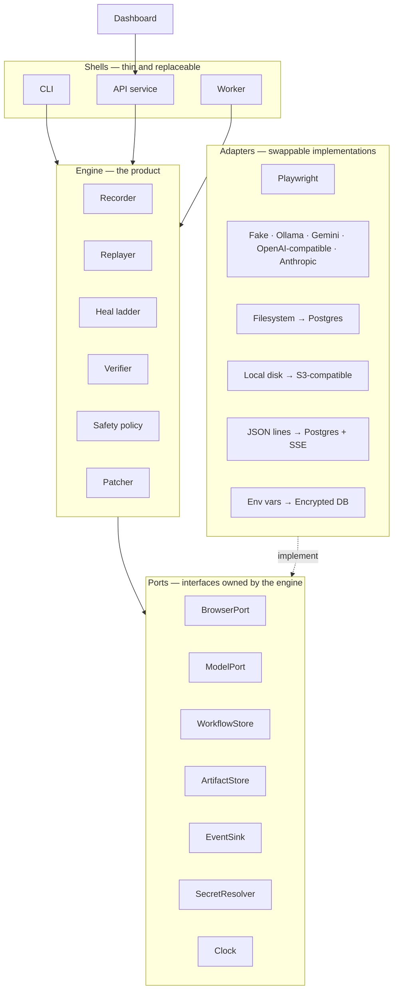

# Mendwork — Architecture

> "Mendwork" is a working name. Rename it before Phase 0 ends if you like; nothing depends on it.

## 1. What this is

**Problem.** Repetitive tasks on websites without APIs are automated today with one of two approaches. Fixed scripts are cheap but break whenever a site's layout changes. AI agents that reason through every step adapt to change but are slow, costly, and inconsistent.

**Solution.** Mendwork records a workflow once and replays it deterministically at near-zero cost. It uses AI only when a step can't find its target, verifies every repair before trusting it, and saves verified repairs permanently. Maintenance cost falls over time instead of growing.

**The whole idea in one picture.** A recorded workflow is a recipe. Replaying it is cooking from the recipe: fast and free. When an ingredient isn't on its usual shelf, the cook first reads the labels on nearby shelves (free). Only if still unsure does the cook ask an assistant (cheap). The cook tastes the dish before serving it (verification), then updates the recipe card so tomorrow it goes straight to the new shelf (patching).

---

## 2. Design principles

These are the rules every design decision is checked against.

1. **The engine is the product.** The engine is a plain Python library. It knows nothing about web servers, databases, or dashboards. The CLI, API, worker, and dashboard are thin shells around it. This lets us test the core without infrastructure and swap shells without touching it.
2. **The happy path never calls AI.** If nothing changed on the site, a run makes zero model calls.
3. **AI chooses; it never invents.** The model only picks from a numbered list of real elements found on the page. It cannot write selectors. If it hallucinates, the answer is out of range and becomes "abstain", which is a safe outcome.
4. **A heal is a proposal until verified.** A repaired step counts as successful only after its checkpoint passes.
5. **Irreversible steps never heal on their own.** Submitting, paying, deleting, or sending requires human approval before a healed target is used.
6. **Workflows are versioned and immutable.** A heal creates a new version and never edits the old one, so any version can be rolled back.
7. **Abstaining is a success.** When the bot isn't sure, stopping and asking is the correct outcome, and it is measured as correct.
8. **Tenant isolation from day one.** Every stored record belongs to a workspace, and the data layer cannot query without one.
9. **Bring your own model.** The default is a free local model. Providers are swappable adapters, companies plug in their own keys, and hard budget caps prevent surprise bills.
10. **Measured, not claimed.** The benchmark is a first-class component, not an afterthought.

---

## 3. System overview



**Dependency rule:** shells → engine → ports. Adapters implement ports. The engine never imports adapters, Playwright, httpx, FastAPI, or SQLAlchemy. `import-linter` enforces this in CI.

---

## 4. Repository layout

```
mendwork/
├── CLAUDE.md                     # working rules for Claude Code
├── ARCHITECTURE.md               # this file
├── BUILD_PLAN.md                 # phased build prompts
├── pyproject.toml                # uv-managed, single package, src layout
├── uv.lock
├── Makefile                      # install fmt lint typecheck imports test check portal bench
├── .importlinter                 # architecture boundary contracts
├── package.json                  # dev-only JS tooling (TypeScript), no runtime deps
├── package-lock.json
├── tsconfig.json                 # checkJs + strict, noEmit — type-checks plain JS
├── .vscode/                      # recommended extensions + editor settings
├── .pre-commit-config.yaml
├── .github/workflows/ci.yml
├── docker-compose.yml            # postgres (Phase 10), api, worker
├── docs/
│   ├── adr/                      # one file per architecture decision
│   ├── security.md               # Phase 12
│   └── deploy.md                 # Phase 12
├── schemas/workflow.schema.json  # generated from domain models
├── workflows/examples/           # sample workflows for the chaos portal
├── src/mendwork/
│   ├── engine/
│   │   ├── domain/               # pure models: workflow, step, fingerprint, run, heal
│   │   ├── ports/                # typing.Protocol interfaces
│   │   ├── recording/
│   │   ├── replay/
│   │   ├── healing/              # candidates.py, scoring.py, ladder.py, prompt.py
│   │   ├── verification/
│   │   ├── safety/               # risk, approvals, egress, budgets, redaction
│   │   ├── patching/
│   │   └── errors.py
│   ├── adapters/
│   │   ├── browser_playwright/
│   │   │   └── js/               # injected page scripts: recorder, candidate extraction, set-of-marks
│   │   ├── models/               # fake.py, ollama.py, gemini.py, openai_compatible.py, anthropic.py
│   │   ├── storage_fs/
│   │   ├── storage_postgres/     # Phase 10
│   │   ├── artifacts_local/
│   │   └── secrets_env/
│   ├── apps/
│   │   ├── cli/                  # Typer: record, run, approve, history, diff, rollback, bench
│   │   ├── api/                  # Phase 10: FastAPI
│   │   └── worker/               # Phase 10
│   ├── settings.py               # pydantic-settings, env prefix MENDWORK_
│   ├── observability.py          # structlog setup: JSON in prod, stderr only, redaction
│   └── py.typed                  # PEP 561 marker: this package ships type information
├── chaos-portal/                 # static demo site + seeded mutation engine (plain JS, @ts-check)
│   └── types/                    # type-only .d.ts files (e.g. window.__chaos)
├── benchmarks/
│   ├── chaos/                    # seed suites
│   ├── real_apps/                # release A → release B harness
│   └── fixtures/dom/             # before/after DOM snapshots for fast tests
├── dashboard/                    # Phase 11: React + Vite + TypeScript
└── tests/
    ├── fakes/                    # in-memory port implementations
    ├── unit/
    ├── integration/
    └── e2e/
```

It is a single Python package with enforced internal boundaries. We avoid a multi-package workspace because it adds packaging overhead without adding safety beyond what `import-linter` already provides.

---

## 5. Domain model

All domain models are **Pydantic v2, frozen, fully typed**. Variants use discriminated unions, not loose dicts.

```python
class ActionType(StrEnum):
    NAVIGATE = "navigate"; CLICK = "click"; FILL = "fill"
    SELECT = "select"; PRESS = "press"; DOWNLOAD = "download"

class RiskLevel(StrEnum):
    SAFE = "safe"                  # navigation, filters, reading
    CAUTION = "caution"            # filling fields without submitting
    IRREVERSIBLE = "irreversible"  # submit, pay, delete, send, confirm

class Selector(BaseModel):
    strategy: Literal["test_id", "role_name", "label", "placeholder", "text", "css"]
    value: str

class Fingerprint(BaseModel):
    """Everything we know about a target element, so one changed clue doesn't lose it."""
    tag: str
    role: str | None
    accessible_name: str | None
    text: str | None
    attributes: dict[str, str]        # allowlisted: id, name, data-testid, aria-label, placeholder, type, href-path
    label_text: str | None
    nearby_text: tuple[str, ...]      # nearest heading, preceding label, row/column headers
    structural_path: str              # simplified ancestor chain
    bbox: NormalizedBox | None        # position relative to viewport, 0..1
    selectors: tuple[Selector, ...]   # ranked best-first

# Values typed into fields — secrets are NEVER stored inline
ValueRef = Annotated[LiteralValue | InputValue | SecretValue, Field(discriminator="kind")]

# What "this step worked" means
Checkpoint = Annotated[
    UrlMatches | ElementVisible | TextPresent | DownloadCompleted | ResponseReceived | NoErrorBanner,
    Field(discriminator="kind"),
]

class Step(BaseModel):
    id: StepId
    intent: str                        # "Click the Download CSV button"
    action: ActionType
    target: Fingerprint | None         # None for NAVIGATE
    value: ValueRef | None
    checkpoints: tuple[Checkpoint, ...]
    risk: RiskLevel

class WorkflowVersion(BaseModel):
    workflow_id: WorkflowId
    version: int
    parent_version: int | None
    steps: tuple[Step, ...]
    change: ChangeRecord | None        # why this version exists
    created_at: datetime

class HealAttempt(BaseModel):
    step_id: StepId
    rung: Literal[0, 1, 2, 3]
    candidates: tuple[ScoredCandidate, ...]   # top N with per-feature breakdown
    chosen: CandidateId | None
    score: float | None
    margin: float | None
    model_usage: ModelUsage | None
    outcome: Literal["resolved", "ambiguous", "not_found", "abstained", "budget_exceeded"]
```

**Run states:** `QUEUED → RUNNING → SUCCEEDED | FAILED | CANCELLED | AWAITING_APPROVAL | NEEDS_REVIEW`

**Error hierarchy** (`engine/errors.py`): `MendworkError` → `TargetNotFound`, `AmbiguousTarget`, `CheckpointFailed`, `NavigationError`, `ProviderError`, `PolicyViolation`, `BudgetExceeded`, `WorkflowValidationError`.

---

## 6. Run lifecycle

1. Load the `WorkflowVersion`. Validate run inputs. Resolve secret references only in memory, at the moment of use.
2. Check the start URL against the workspace's egress policy.
3. For each step:
   1. Emit `step_started`.
   2. Resolve the target through the heal ladder, starting at Rung 0.
   3. If the target was healed and the step is `IRREVERSIBLE`, pause the run as `AWAITING_APPROVAL` with the evidence attached.
   4. Run pre-action checks: element is visible, enabled, and compatible with the action.
   5. Perform the action.
   6. Evaluate every checkpoint.
   7. **Pass:** record the `StepResult`, plus a `ChangeRecord` if the step was healed. **Fail:** apply the recovery policy (§8).
4. Finish: set the final status, total model usage and estimated cost, store artifacts, and apply the patch promotion policy (§9).

Transient retries (such as navigation timeouts) are **separate from healing**. They retry the same target with bounded exponential backoff.

---

## 7. The heal ladder

Each rung is more expensive than the one before it. We only climb when the rung below fails.

| Rung | What it does | Cost |
|---|---|---|
| **0** | Try the recorded selectors in ranked order. A selector must match **exactly one** visible element: zero matches is not-found, and more than one is ambiguous, never a success. | Free |
| **1** | Try alternate selectors derived from the fingerprint (test id, role + name, label, placeholder, text). | Free |
| **2** | Similarity scoring over live candidates (below). | Free |
| **3** | The model chooses among the top-K candidates from Rung 2. | Cents or $0 local |
| **4** | Abstain: pause for a human or fail with a full evidence report. | Free |

### Rung 2 — similarity scoring

- **Candidate generation:** visible elements compatible with the action (clickable for CLICK, editable for FILL, and so on).
- **Features**, each normalized to 0..1:
  - accessible name similarity (rapidfuzz)
  - role match
  - attribute overlap
  - label similarity
  - nearby-text similarity
  - structural path similarity
  - position proximity
- **Score:** a weighted sum. Weights live in `Settings`, not in code.
- **Accept rule:** `top_score ≥ T_ACCEPT` **and** `top_score − second_score ≥ M_MARGIN`. The margin check is what prevents clicking one of two look-alike buttons.
- Weights start hand-set (brute force). **Optional ML upgrade:** learn the weights, or a small ranking model, from benchmark data, then compare it against the hand-set weights and the LLM on accuracy, latency, and cost.

### Rung 3 — constrained model choice

- **Input:**
  - the step intent
  - a summary of the original fingerprint
  - the top-K candidates as a numbered list (role, name, label, nearby text)
  - optionally, a screenshot with numbered boxes drawn over the candidates, if the provider supports images
- **Output schema:** `{"choice": int | null, "confidence": float, "reason": str}`, parsed strictly with Pydantic.
- Invalid output gets one repair retry, then abstains. A choice outside `1..K` abstains. `null` abstains.
- The model's confidence alone never accepts a heal. The chosen element must still pass verification.
- **Budgets:** a maximum number of model calls per run and per workspace per day. Exceeding either raises `BudgetExceeded` and abstains.

Every rung emits a `HealAttempt` event with its full evidence, so every decision can be explained later.

---

## 8. Verification, recovery, and safety

### Checkpoints

Recording auto-proposes checkpoints: a URL change, a new heading or landmark becoming visible, a download event, or a network response. Users can edit them. Every checkpoint has a timeout and relies on Playwright's auto-waiting; **there are no fixed sleeps anywhere.**

### Recovery policy

| Risk | On failed checkpoint after a heal |
|---|---|
| SAFE | Restore the last good checkpoint state (re-navigate or replay from it), try the next candidate, up to `MAX_HEAL_ATTEMPTS`. |
| CAUTION | Same as SAFE, and reset the affected form state first. |
| IRREVERSIBLE | Never auto-retry. Heals require approval **before** acting. If a run is interrupted after an irreversible action executed, it becomes `NEEDS_REVIEW` and is never re-queued automatically. |

### Risk classification

A step is auto-classified as `IRREVERSIBLE` when it submits a form or its name matches configurable danger keywords (delete, remove, pay, purchase, submit, send, confirm, transfer). Fills are `CAUTION`; everything else is `SAFE`. **When unsure, choose the stricter level.** Users can raise a step's risk level but not lower an auto-detected `IRREVERSIBLE` without an audit entry.

### Egress policy (SSRF protection)

- Per-workspace allowlist of domains for top-level navigation.
- Block non-http(s) schemes.
- Resolve hostnames and block loopback, private, link-local, and cloud-metadata IP ranges, so the bot can never be pointed at internal networks.
- Enforced both as a pre-navigation check and through Playwright request routing.

### Secrets

- Workflows store only secret *references*.
- A `SecretResolver` port supplies values at the moment of use.
- A structlog redaction processor guarantees secret values never appear in logs, events, or artifacts. This is tested.

### Explicit non-goals

- CAPTCHA solving, bot-detection evasion, or anything else that circumvents a site's protections.
- The tool automates only sites a workspace is authorized to automate.

---

## 9. Patching and versions

- A verified heal on a SAFE or CAUTION step produces a `ChangeRecord` containing:
  - old vs new fingerprint
  - which rung healed it
  - score and margin, or model usage
  - artifact links
- The `ChangeRecord` produces a **child** `WorkflowVersion`. IRREVERSIBLE heals do this only after approval.
- **Promotion policy** (Settings):
  - `immediate` persists the new version right away.
  - `after_n_successes` applies the patch as a first-try candidate on later runs and persists it only after N verified successes.
- Users can view history, diff any two versions in human-readable form, and roll back to any version.
- **The key guarantee:** after a heal is promoted, rerunning the same page state uses **zero heals and zero model calls**.

---

## 10. Model providers

```python
class ModelPort(Protocol):
    async def choose_candidate(self, request: ChoiceRequest) -> ChoiceResult: ...
```

- **Adapters:**
  - `FakeModel` (deterministic, for tests)
  - `Ollama` (local, free)
  - `Gemini` (free tier, dev/demo only)
  - `OpenAI-compatible` (any host exposing that API, including local servers)
  - `Anthropic`
- **Shared behaviour:**
  - timeouts
  - retries with exponential backoff and jitter on 429 and 5xx responses
  - a circuit breaker
  - usage, latency, and estimated-cost recording (cost table in config; local = $0)
- **Data policy:** free hosted tiers may use inputs to improve the provider's models. Use them **only with chaos-portal and benchmark data**. Company workspaces must use a local model or their own paid key.
- Model names are configuration, never hardcoded. Small models change monthly.

---

## 11. Multi-tenancy and security (built in Phase 10, designed now)

- **Workspace:** the tenant boundary. Every tenant table has `workspace_id NOT NULL`, and repository methods require a `WorkspaceContext`. Postgres row-level security is optional defense in depth.
- **Members and roles:** owner, admin, operator (run and approve), viewer.
- **API keys:**
  - random 32+ bytes, shown once
  - stored as prefix + SHA-256 hash
  - scoped, revocable, with `last_used_at` tracked
- **Secrets and saved browser sessions:** encrypted with `MultiFernet`, master keys from environment, key rotation supported.
- **Audit events** (append-only) record key creation, approvals, policy changes, rollbacks, and risk downgrades.
- **Browser isolation:**
  - a fresh browser context per run, with no shared cookies across workspaces
  - a per-run downloads directory
  - non-root worker containers with resource limits and max concurrency
- **Logging:** structured, secrets redacted, `run_id`/`step_id`/`workspace_id` correlation on every line.
- **v1 access model:** invite-only. The platform admin creates workspaces and issues keys. No self-serve signup, billing, or SSO in v1.

---

## 12. Service layer (Phase 10)

- **API:** FastAPI under `/v1`.
  - workflows, versions, runs (`POST` with `Idempotency-Key`), run events (Server-Sent Events), heal proposals (approve/reject), secrets (write-only), API keys (admin)
  - RFC 9457 problem-details errors, cursor pagination, per-key rate limits, OpenAPI docs
- **Queue:** the `runs` table *is* the queue.
  - Workers claim jobs with `SELECT … FOR UPDATE SKIP LOCKED`.
  - Heartbeats plus lease expiry re-queue crashed runs, respecting the `NEEDS_REVIEW` rule.
  - No Redis needed.
- **Events:** the engine emits to an `EventSink`. Events are persisted to `run_events` and streamed to the dashboard over SSE.
- **Artifacts:** a screenshot per step; Playwright trace and DOM snapshot on failure or heal. Stored behind the `ArtifactStore` port (local disk, then S3-compatible), with configurable retention.

---

## 13. Benchmarking

### Chaos portal

- A static fictional supplier portal with a seeded mutation engine (`?seed=&level=&only=`). The same seed always produces the same page.
- Ground truth is exposed as `window.__chaos`.
- **Heal-expected mutations:**
  - synonym renames
  - sibling reorder
  - id/class changes
  - extra wrappers
  - moving a control to another container
  - button↔link swap
  - icon-only button with aria-label
  - cookie banner
- **Abstain-expected mutations:**
  - target removed
  - two equally plausible controls
  - control renamed to a dangerous opposite (e.g. "Download" → "Delete data")

### Real-app pairs

A workflow recorded on release A of a self-hosted open-source web app is replayed on release B, running locally in Docker. These are real UI changes nobody faked, on our own instances, so there is no terms-of-service issue.

### Metrics

- **Wrong-action rate** (headline metric; target 0)
- heal success rate
- correct-abstain rate
- unnecessary-abstain rate
- model calls per run
- estimated cost per run
- p50/p95 step latency
- rung distribution

### Baselines

- recorded CSS selector only
- Playwright role + name locator only
- full ladder without Rung 3
- full ladder

### Output

Versioned results JSON and a static HTML scorecard. CI runs a small smoke benchmark and **fails if the wrong-action rate is above 0**.

---

## 14. Testing strategy

| Layer | Covers | Rules |
|---|---|---|
| Unit | domain, scoring, policies, prompt building, parsing | No network, no browser; fakes from `tests/fakes`; `hypothesis` for invariants |
| DOM fixtures | heal ladder decisions | Saved before/after snapshots loaded with `page.set_content`; a wrong click fails the test |
| Integration | replayer, recorder, verifier | Against the locally served chaos portal only |
| Provider contract | model adapters | Recorded HTTP fixtures (`respx`); live calls only via `make live-providers` |
| API | endpoints, tenant isolation, queue | Real Postgres (CI service container); isolation tests for every resource |
| E2E | full run, heal, patch, rerun with zero model calls | CLI first, then API |

**Coverage gates:** engine ≥ 90% lines, overall ≥ 85%.

**No flaky tests:** fixed seeds, injected `Clock`, no sleeps.

---

## 15. Tech stack

Everything below is free and open source.

| Concern | Choice |
|---|---|
| Language | Python 3.12+ |
| Environment and packaging | uv |
| Browser automation | Playwright (async API) |
| Models, validation, config | Pydantic v2, pydantic-settings |
| Fuzzy text matching | rapidfuzz |
| CLI | Typer |
| API | FastAPI + Uvicorn |
| Database | PostgreSQL 16, SQLAlchemy 2.0 (async), asyncpg, Alembic |
| Job queue | Postgres `SKIP LOCKED` |
| HTTP client | httpx (respx in tests) |
| Logging | structlog |
| Encryption | cryptography (Fernet / MultiFernet) |
| Quality gates | ruff, mypy --strict, import-linter, pytest, pytest-asyncio, pytest-cov, hypothesis, pre-commit, pip-audit |
| Dashboard | React + Vite + TypeScript |
| Browser-side JavaScript | Plain JS with JSDoc types, checked by TypeScript (`checkJs`, `noEmit`); no build step |
| JS tooling | Node.js LTS + TypeScript compiler (dev-only) |
| Reverse proxy | Caddy (automatic HTTPS) |
| CI | GitHub Actions |

### Languages, and when to add one

| Language | Used for | Why |
|---|---|---|
| Python | Engine, CLI, API, worker, benchmark | Best AI and Playwright ecosystem; the core of the product |
| TypeScript | Dashboard | Type safety for a large UI |
| JavaScript + `@ts-check` | Chaos portal, injected page scripts | Code running inside a web page must be JavaScript; TypeScript checks it without a build step |
| SQL | Postgres schema, migrations, queue claims | Data and job queue live in Postgres |
| HTML/CSS | Chaos portal, run reports, scorecard | What browsers render |

A new language is added only when:
1. code must run somewhere the existing languages cannot, or
2. a **measured** problem is fixed by it.

Either way, it requires an ADR. More languages mean more toolchains, more CI steps, and more places to break. Browser automation spends most of its time waiting on pages, so rewriting the core in a faster language would not make runs meaningfully faster.

---

## 16. Zero-cost map

Free tiers change often. Re-check limits before relying on them. The notes below reflect September 2026.

| Need | Free option | Catch |
|---|---|---|
| AI during development | Ollama with a small local model | Needs decent RAM/GPU. Vision support for brand-new models lags in Ollama. Text-only candidate choice (Rung 3 without screenshots) works on modest hardware. |
| Hosted AI for demos | Gemini API free tier (Google AI Studio key) | Flash-class models only, roughly 10–15 requests/minute, limits change without notice. Free-tier data may be used to improve Google's models, so send demo data only. |
| CI | GitHub Actions on a public repo | Keep the repo public. |
| Demo site | GitHub Pages | Static only, which fits the chaos portal. |
| Database | Postgres in Docker locally | — |
| Hosting | Oracle Cloud Always Free ARM VM, or an old laptop with Cloudflare Tunnel | Oracle reportedly cut the free ARM allocation to 2 OCPU / 12 GB in 2026 and requires a card for identity verification. Each headless browser uses hundreds of MB, so expect a handful of concurrent runs. |
| HTTPS | Caddy + Let's Encrypt | Needs a hostname; a free subdomain works. |
| Company-scale AI | The company's own key | Their bill and their data policy, by design. |

---

## 17. Non-goals for v1

- CAPTCHA solving or bot-detection evasion
- Automating 2FA beyond reusing an authorized saved session
- Desktop apps, Citrix, or remote desktops
- Cross-origin iframes (planned for v2)
- Self-serve signup, billing, SSO
- Multi-region or large horizontal scaling

---

## 18. Decision records

Any decision not covered here gets an ADR in `docs/adr/NNNN-short-title.md` with these sections:

- **Context:** what forced a decision
- **Decision:** what we chose
- **Alternatives considered:** with tradeoffs
- **Consequences:** what gets easier or harder

When an ADR changes this document, update this document in the same commit.
